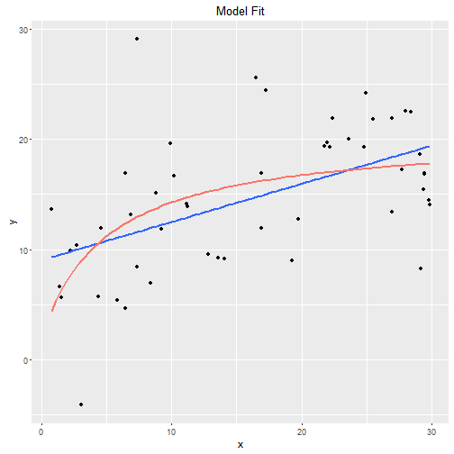

Bayesian ecology in R
========================================================
author: Pavel Jakubec
date: "2016-09-06"
width: 1920
height: 1080
transition: linear


Content
========================================================
* **Scientific reasoning**
   + How we reason
   + Motivated reasoning
   + Objective and transparent conclusions
* **Bayes' theorem**
  + Pros
  + Cons
  
* **Prior knowledge**  
  + 
* **Frequentists vs Bayesians**  
  + Comparison of binomial tests  
* **Normal Linear model**


Reasoning
========================================================
left: 50%
* Rose-ringed parakeet
* Motivated reasoning ()
<br>

### Need for objective and transparent conclusions.  
***
   
*Psittacula krameri*

Bayes' theorem
========================================================
left: 70%
$$P(A \mid B)= \frac {P(A )P(B \mid A ))}{P(A)}$$   
<br>
$$P(\theta \mid y)= \frac {P(\theta )P(y\mid \theta ))}{P(y)}$$
#### $\theta$ = Model parameter   
#### y = Actual data

***
   
*Thomas Bayes (1702 - 1761)*

Basic vocabulary
========================================================
* **Prior**
* **Posterior**


* **MCMC** - Markov chain Monte Carlo (the most well known, but not only sampler from marginal posterior o)

**Confidence interval x Credible interval**
* We are 95% sure that the true mean is within this interval
* The range of likely values of the parameter (defined as the point estimate + margin of error) with a specified level of confidence.

Prior knowledge
========================================================

### Cancer  case
<br>
Positive cancer test $\neq$ cancer  


```r
# Variables
TP <- 0.9 #True Positive: 90%
FP <- 0.1 #False Positive: 10%
```

$$P(cancer \mid positive test)= \frac {P(cancer )P(positive test \mid cancer))}{P(cancer )P(positive test \mid cancer))+P(no cancer)P(no cancer \mid positive test)}$$

```r
prior <- 0.1 #Prior (prevalence of cancer in population): 1%

# Bayesian interpretation of the test
result <- (TP*prior)/(TP*prior+FP*(1-prior))

result*100
```

```
[1] 50
```


Pros and cons
======================================================
* ### Bayesians are (more or less) ok with:
Using prior knowledge   
Low sample size (rare species, lots of NAs, expensive sampling)   
Multiple comparisons [(Geldman et al., 2012)](http://goo.gl/SX1uVG)  

* ### Upside
More meaningful inferences (only exact way how to draw inferences for generalized mixed models [(Bolker et al., 2008)](goo.gl/MQG1vS)

* ### Downside
Priors can disproportionaly influence the posterior  
Choosing the right/appropriate prior can be challenging   
Computation heavy (less problem now)   
Garbage in = Garbage out


Exagerated example of two approaches
=======================================================
left: 70%

STORY: We screened Amur Leopard (*Panthera pardus orientalis*) for presence of dangerous blood parasite. If the true percentage of infected ones is greater then 10% we have to inform autorities and take measures to treat them.
   
CHALENGE: Amur Leoprad is very rare and endangered animal, therefore you should use the smallest sample posible.


```r
data <- data          #Hidden data
N <- c(5,10,15,20,40) #Sample size
sub <- list()         #List for storing data values with different N    
tests.freq <- list()  #List for storing results of exact binomial test
tests.bayes <- list() #List for storing results of bayesian version of exact binomial test
for (i in 1:5) {
  sub[[i]] <- data[1:N[i]]
  tests.freq[[i]] <- stats::binom.test (c(length(sub[[i]][sub[[i]]=="1"]), length(sub[[i]][sub[[i]]=="0"])), p=0.1, alternative="greater")
  tests.bayes[[i]] <- BayesianFirstAid::bayes.binom.test(c(length(sub[[i]][sub[[i]]=="1"]), length(sub[[i]][sub[[i]]=="0"])), p=0.1, n.iter = 150000)
}
```
***
   
*Panthera pardus orientalis*

Exagerated example of two approaches
=======================================================


```r
tests.freq[[1]]
```

```

	Exact binomial test

data:  c(length(sub[[i]][sub[[i]] == "1"]), length(sub[[i]][sub[[i]] ==     "0"]))
number of successes = 1, number of trials = 5, p-value = 0.4095
alternative hypothesis: true probability of success is greater than 0.1
95 percent confidence interval:
 0.01020622 1.00000000
sample estimates:
probability of success 
                   0.2 
```

```r
tests.freq[[2]]
```

```

	Exact binomial test

data:  c(length(sub[[i]][sub[[i]] == "1"]), length(sub[[i]][sub[[i]] ==     "0"]))
number of successes = 2, number of trials = 10, p-value = 0.2639
alternative hypothesis: true probability of success is greater than 0.1
95 percent confidence interval:
 0.03677144 1.00000000
sample estimates:
probability of success 
                   0.2 
```
Exagerated example of two approaches
=======================================================


```r
tests.freq[[3]]
```

```

	Exact binomial test

data:  c(length(sub[[i]][sub[[i]] == "1"]), length(sub[[i]][sub[[i]] ==     "0"]))
number of successes = 3, number of trials = 15, p-value = 0.1841
alternative hypothesis: true probability of success is greater than 0.1
95 percent confidence interval:
 0.05684687 1.00000000
sample estimates:
probability of success 
                   0.2 
```

```r
tests.freq[[4]]
```

```

	Exact binomial test

data:  c(length(sub[[i]][sub[[i]] == "1"]), length(sub[[i]][sub[[i]] ==     "0"]))
number of successes = 4, number of trials = 20, p-value = 0.133
alternative hypothesis: true probability of success is greater than 0.1
95 percent confidence interval:
 0.07135388 1.00000000
sample estimates:
probability of success 
                   0.2 
```


Exagerated example of two approaches
=======================================================
* The true proportion of infected animals is 20 %.

```r
data
```

```
 [1] 0 0 0 0 1 0 0 0 0 1 0 0 0 0 1 0 0 0 0 1 0 0 0 0 1 0 0 0 0 1 0 0 0 0 1
[36] 0 0 0 0 1
```

* We would need probably **ALL** Amur Leopards in the World to barely reject frequntist's H0 and do something to save them.     

This is linked to statistical power of the test:

```r
h<-pwr::ES.h(0.2,0.1) #true proportion is 20% and H0 proportion is 10%
pwr::pwr.p.test(h=h, power=0.8, sig.level=0.05, alternative = "greater")
```

```

     proportion power calculation for binomial distribution (arcsine transformation) 

              h = 0.2837941
              n = 76.76467
      sig.level = 0.05
          power = 0.8
    alternative = greater
```

* If the frequentist's H0 would be different, the outcome would be also different.  

Normal "Linear" Model - simulation
=======================================================
left: 60%
Michaelis-Menten curve: 
$$f(x) = \frac {ax}{(b+x)}$$

```r
##Data simulation
set.seed(1337) # non-random generation
#Parameters
n <-  501 # sample size
sigma <- 5 # standard deviation of the residuals
a <- 20 # asymptote 
b <- 5 # half-maximum
#Simulation part
x <- runif(n, 0, 30) # sample values of the covariate
y <- rnorm(x, micmen(x, a=a,b=b), sd=sigma)
```
***



Normal Linear Model - simulation
=======================================================

```r
summary(lm(y~x))
```

```

Call:
lm(formula = y ~ x)

Residuals:
     Min       1Q   Median       3Q      Max 
-15.2747  -3.9113   0.0648   3.8975  17.0065 

Coefficients:
            Estimate Std. Error t value Pr(>|t|)    
(Intercept)  7.92179    0.47766   16.59   <2e-16 ***
x            0.38293    0.02768   13.84   <2e-16 ***
---
Signif. codes:  0 '***' 0.001 '**' 0.01 '*' 0.05 '.' 0.1 ' ' 1

Residual standard error: 5.42 on 499 degrees of freedom
Multiple R-squared:  0.2773,	Adjusted R-squared:  0.2758 
F-statistic: 191.4 on 1 and 499 DF,  p-value: < 2.2e-16
```

