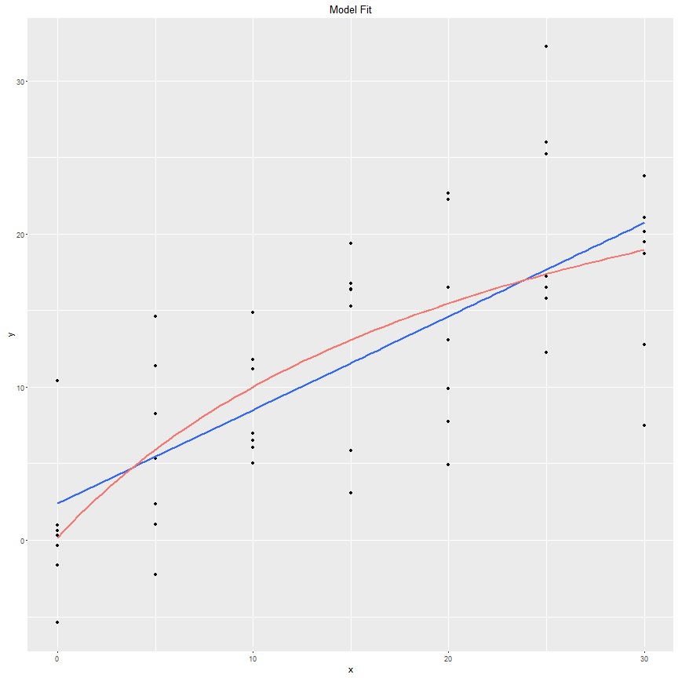
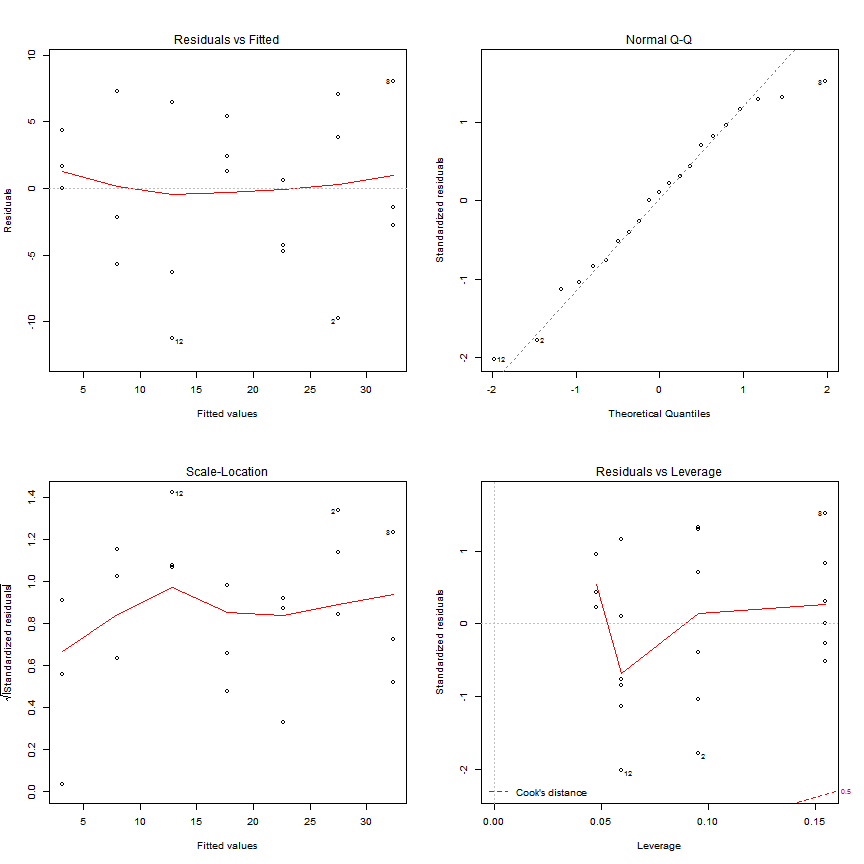

Bayesian ecology in R
========================================================
author: Pavel Jakubec
date: "2016-09-14"
width: 1600
height: 1200
transition: linear


Content
========================================================
* **Scientific reasoning**
   + How we reason
   + Motivated reasoning
* **Bayes' theorem**
  + Explanation
  + Terminology
  + Pros & Cons
* **Prior knowledge**  
  + Example
* **Frequentists vs Bayesians**  
  + Comparison of binomial tests  
* **Normal Linear model**
  + Simulation
  + Inspection
  + Conclusions


Reasoning
========================================================
left: 50%

   
*Psittacula krameri*

***

* Rose-ringed parakeet
  + How many birds you have to see?
* Motivated reasoning & cognitive bias
<br>
<div style="width:600px; height=450px">

</div> 
*Alfred Dreyfus and Georges Picquart*

<br>
## Need for objective and transparent conclusions.  

Bayes' theorem
========================================================
left: 70%
$$P(A \mid B)= \frac {P(A )P(B \mid A ))}{P(A)}$$   
<br>
$$P(\theta \mid y)= \frac {P(\theta )P(y\mid \theta ))}{P(y)}$$
#### $\theta$ = Model parameter   
#### y = Actual data
$P(y)=\int P(\theta)P(y\mid\theta)d\theta$

### Bayesians  
Data = Truth, Parameters ~ Probability distribution  
We are re-allocating credibility across possibilities  


***
   
*Thomas Bayes (1702 - 1761)*


Basic vocabulary
========================================================
* **Prior** - prior probability distribution (our believes)
* **Posterior** - posterior probability distribution (in what we should believe after seeing the evidence (the data)) 
* **Marginal Posterior** - probability distribution of single model parameter
* **Likelihood** - $P(y\mid \theta )$  - measure of the information we can gain from the data
* **MCMC** - Markov chain Monte Carlo (the most well known, but not only sampler from marginal posterior)

**Confidence interval vs. Credible interval**
* We are 95% sure that the true mean is within this interval
* The range of likely values of the parameter (defined as the point estimate + margin of error) with a specified level of confidence.  

***

```r
triplot.normal.knownvariance2(theta.data=4, variance.known=4, n=5, prior.theta=8, prior.variance=4)
```


Prior knowledge
========================================================


```r
triplot.normal.knownvariance2(theta.data=4, variance.known=4, n=5, prior.theta=8, prior.variance=4)
```


***


```r
triplot.normal.knownvariance2(theta.data=4, variance.known=4, n=5, prior.theta=8, prior.variance=1)
```


Prior knowledge
========================================================

### Cancer  case
<br>
Positive cancer test $\neq$ cancer  


```r
# Variables
TP <- 0.9 #True Positive: 90%
FP <- 0.1 #False Positive: 10%
```

$$P(cancer \mid positive test)= \frac {P(cancer )P(positive test \mid cancer))}{P(cancer )P(positive test \mid cancer))+P(no cancer)P(no cancer \mid positive test)}$$

```r
prior <- 0.01 #Prior (prevalence of cancer in population): 1%

# Bayesian interpretation of the test
result <- (TP*prior)/(TP*prior+FP*(1-prior))

result*100
```

```
[1] 8.333333
```


Pros and cons
======================================================
left: 70%
* ### Bayesians are (more or less) ok with:
Using prior knowledge   
Low sample size (rare species, lots of NAs, expensive sampling)   
Multiple comparisons [(Geldman et al., 2012)](http://goo.gl/SX1uVG)  
Good way how to speed up science & research (significant results can be disproved)

* ### Upside
More meaningful and comprehensive inferences (the only exact way how to draw inferences for generalized mixed models [(Bolker et al., 2008)](goo.gl/MQG1vS)

* ### Downside
Priors can disproportionally influence the posterior  
Choosing the right/appropriate prior can be challenging   
Computation heavy (less problem now)   
Garbage in = Garbage out

***


Exagerated example of two approaches
=======================================================
left: 70%

STORY: We screened Amur Leopard (*Panthera pardus orientalis*) for presence of dangerous blood parasite. If the true percentage of infected ones is greater then 10% we have to inform authorities and take measures to treat them.
   
CHALENGE: Amur Leopard is very rare and endangered animal, therefore you should use the smallest sample possible


```r
data <- data          #Hidden data
N <- c(5,10,15,20,40) #Sample size
sub <- list()         #List for storing data values with different N    
tests.freq <- list()  #List for storing results of exact binomial test
tests.bayes <- list() #List for storing results of bayesian version of exact binomial test
for (i in 1:5) {
  sub[[i]] <- data[1:N[i]]
  tests.freq[[i]] <- stats::binom.test (c(length(sub[[i]][sub[[i]]=="1"]), length(sub[[i]][sub[[i]]=="0"])), p=0.1, alternative="greater")
  tests.bayes[[i]] <- BayesianFirstAid::bayes.binom.test(c(length(sub[[i]][sub[[i]]=="1"]), length(sub[[i]][sub[[i]]=="0"])), p=0.1, n.iter = 150000)
}
```
***
   
*Panthera pardus orientalis*

Exagerated example of two approaches
=======================================================


```r
tests.freq[[1]]
```

```

	Exact binomial test

data:  c(length(sub[[i]][sub[[i]] == "1"]), length(sub[[i]][sub[[i]] ==     "0"]))
number of successes = 1, number of trials = 5, p-value = 0.4095
alternative hypothesis: true probability of success is greater than 0.1
95 percent confidence interval:
 0.01020622 1.00000000
sample estimates:
probability of success 
                   0.2 
```

```r
tests.freq[[2]]
```

```

	Exact binomial test

data:  c(length(sub[[i]][sub[[i]] == "1"]), length(sub[[i]][sub[[i]] ==     "0"]))
number of successes = 2, number of trials = 10, p-value = 0.2639
alternative hypothesis: true probability of success is greater than 0.1
95 percent confidence interval:
 0.03677144 1.00000000
sample estimates:
probability of success 
                   0.2 
```
Exagerated example of two approaches
=======================================================


```r
tests.freq[[3]]
```

```

	Exact binomial test

data:  c(length(sub[[i]][sub[[i]] == "1"]), length(sub[[i]][sub[[i]] ==     "0"]))
number of successes = 3, number of trials = 15, p-value = 0.1841
alternative hypothesis: true probability of success is greater than 0.1
95 percent confidence interval:
 0.05684687 1.00000000
sample estimates:
probability of success 
                   0.2 
```

```r
tests.freq[[4]]
```

```

	Exact binomial test

data:  c(length(sub[[i]][sub[[i]] == "1"]), length(sub[[i]][sub[[i]] ==     "0"]))
number of successes = 4, number of trials = 20, p-value = 0.133
alternative hypothesis: true probability of success is greater than 0.1
95 percent confidence interval:
 0.07135388 1.00000000
sample estimates:
probability of success 
                   0.2 
```


Exagerated example of two approaches
=======================================================
* The true proportion of infected animals is 20 %.

```r
data
```

```
 [1] 0 0 0 0 1 0 0 0 0 1 0 0 0 0 1 0 0 0 0 1 0 0 0 0 1 0 0 0 0 1 0 0 0 0 1
[36] 0 0 0 0 1
```

* We would need probably **ALL** Amur Leopards in the World to barely reject frequentist's H0 and do something to save them.     

This is linked to statistical power of the test:

```r
h<-pwr::ES.h(0.2,0.1) #true proportion is 20% and H0 proportion is 10%
pwr::pwr.p.test(h=h, power=0.8, sig.level=0.05, alternative = "greater")
```

```

     proportion power calculation for binomial distribution (arcsine transformation) 

              h = 0.2837941
              n = 76.76467
      sig.level = 0.05
          power = 0.8
    alternative = greater
```

* If the frequentist's H0 would be different, the outcome would be also different, which is not the case for Bayesian variant.  

Exagerated example of two approaches
=======================================================


```r
tests.bayes[[1]]
```

```

	Bayesian First Aid binomial test

data: c(length(sub[[i]][sub[[i]] == "1"]), length(sub[[i]][sub[[i]] ==     "0"]))
number of successes = 1, number of trials = 5
Estimated relative frequency of success:
  0.26 
95% credible interval:
  0.020 0.59 
The relative frequency of success is more than 0.1 by a probability of 0.886 
and less than 0.1 by a probability of 0.114 
```

```r
tests.bayes[[2]]
```

```

	Bayesian First Aid binomial test

data: c(length(sub[[i]][sub[[i]] == "1"]), length(sub[[i]][sub[[i]] ==     "0"]))
number of successes = 2, number of trials = 10
Estimated relative frequency of success:
  0.24 
95% credible interval:
  0.038 0.48 
The relative frequency of success is more than 0.1 by a probability of 0.911 
and less than 0.1 by a probability of 0.089 
```
Exagerated example of two approaches
=======================================================


```r
tests.bayes[[3]]
```

```

	Bayesian First Aid binomial test

data: c(length(sub[[i]][sub[[i]] == "1"]), length(sub[[i]][sub[[i]] ==     "0"]))
number of successes = 3, number of trials = 15
Estimated relative frequency of success:
  0.22 
95% credible interval:
  0.058 0.43 
The relative frequency of success is more than 0.1 by a probability of 0.93 
and less than 0.1 by a probability of 0.07 
```

```r
tests.bayes[[4]]
```

```

	Bayesian First Aid binomial test

data: c(length(sub[[i]][sub[[i]] == "1"]), length(sub[[i]][sub[[i]] ==     "0"]))
number of successes = 4, number of trials = 20
Estimated relative frequency of success:
  0.22 
95% credible interval:
  0.069 0.40 
The relative frequency of success is more than 0.1 by a probability of 0.947 
and less than 0.1 by a probability of 0.053 
```

Exagerated example of two approaches
=======================================================


```r
tests.freq[[5]]
```

```

	Exact binomial test

data:  c(length(sub[[i]][sub[[i]] == "1"]), length(sub[[i]][sub[[i]] ==     "0"]))
number of successes = 8, number of trials = 40, p-value = 0.0419
alternative hypothesis: true probability of success is greater than 0.1
95 percent confidence interval:
 0.1036061 1.0000000
sample estimates:
probability of success 
                   0.2 
```

```r
tests.bayes[[5]]
```

```

	Bayesian First Aid binomial test

data: c(length(sub[[i]][sub[[i]] == "1"]), length(sub[[i]][sub[[i]] ==     "0"]))
number of successes = 8, number of trials = 40
Estimated relative frequency of success:
  0.21 
95% credible interval:
  0.097 0.34 
The relative frequency of success is more than 0.1 by a probability of 0.982 
and less than 0.1 by a probability of 0.018 
```

Normal "Linear" Model - simulation
=======================================================
left: 60%
Michaelis-Menten curve:
$$f(x) = \frac{ax}{b+x}$$


```r
##Data simulation
#Parameters
set.seed(1337) # non-random generation
sigma <- 5 # standard deviation of the residuals
a <- 30 # asymptote 
b <- 25 # half-maximum
#Simulation part
x <- rep(seq(0,30,5),7)# sample values of the covariate ()
y <- rnorm(x, mean=micmen(x, a=a,b=b), sd=sigma) #
```
***

Normal Linear Model - simulation
=======================================================
left: 60%
Length of development ~ Temperature  


```r
rm(list=ls())
##Data simulation
#Parameters
set.seed(1337) # non-random generation
sigma <- 5 # standard deviation of the residuals
a <- 30 # intercept 
b <- -1 # slope
#Simulation part
x <- rep(seq(0,30,5),3)# Temperature (independent variable)
yhat <- a+b*x
y <- rnorm(x, mean=yhat, sd=sigma) # Length of development(dependent variable)
```
***

Normal Linear Model - Model + Model inspection
=======================================================
left: 30%

```r
# Model
mod <- lm(y~x)
```
***


Normal Linear Model - Model inspection
=======================================================


Normal Linear Model - Bayesian conclusions
=======================================================
When to use arm::sim function:   
* Simple models (lm, glm, lmer, glmer)  
* No prior knowledge  
* We need flat prior distributions  

Other options: Stan, JAGS or Bugs


```r
nsim <- 2000
bsim <- arm::sim(mod, n.sim=nsim)
```

CrI for coefficients and estimated residual standard deviation $\hat{\sigma}$

```r
apply(coef(bsim), 2, quantile, prob=c(0.025, 0.975))
```

```
      (Intercept)          x
2.5%     27.73355 -1.2435867
97.5%    36.84229 -0.7221675
```

```r
quantile(bsim@sigma, prob=c(0.025, 0.975))
```

```
    2.5%    97.5% 
4.402231 8.283158 
```

***


Normal Linear Model - Bayesian conclusions
=======================================================
Is the slope parameter is smaller or bigger then -1?

```r
sum(coef(bsim)[,2]< -1)/nsim
```

```
[1] 0.415
```

```r
sum(coef(bsim)[,2]> -1)/nsim
```

```
[1] 0.585
```

```r
plot(x,y, pch=16, las=1, cex.lab=1.2) # plot observations
for(i in 1:nsim) abline(coef(bsim)[i,1], coef(bsim)[i,2],
col=rgb(0,0,0,0.05)) # add semitransparent regression lines
```


Normal Linear Model - Bayesian conclusions
=======================================================

95% Credible interval

```r
newdat <- data.frame(x=seq(0, 30, by=0.1))
newmodmat <- model.matrix(~x, data=newdat)
fitmat <- matrix(ncol=nsim, nrow=nrow(newdat))
for(i in 1:nsim) fitmat[,i] <- newmodmat %*% coef(bsim)[i,]
plot(x,y, pch=16, las=1, cex.lab=1.2)
abline(mod, lwd=2)
lines(newdat$x, apply(fitmat, 1, quantile, prob=0.025), lty=3)
lines(newdat$x, apply(fitmat, 1, quantile, prob=0.975), lty=3)
```


Normal Linear Model - Bayesian conclusions
=======================================================
95% Credible interval + Posterior predictive distribution

```r
newy <- matrix(ncol=nsim, nrow=nrow(newdat))
# for each simulated fitted value, simulate one new y-value
for(i in 1:nsim) newy[,i] <- rnorm(nrow(newdat), mean=fitmat[,i],
sd=bsim@sigma[i])
plot(x,y, pch=16, las=1, cex.lab=1.2)
abline(mod, lwd=2)
lines(newdat$x, apply(fitmat, 1, quantile, prob=0.025), lty=3)
lines(newdat$x, apply(fitmat, 1, quantile, prob=0.975), lty=3)
lines(newdat$x, apply(newy, 1, quantile, prob=0.025), lty=2)
lines(newdat$x, apply(newy, 1, quantile, prob=0.975), lty=2)
```


Normal Linear Model - Frequentist conclusions
=======================================================
left: 80%

```r
summary(lm(y~x))
```

```

Call:
lm(formula = y ~ x)

Residuals:
     Min       1Q   Median       3Q      Max 
-11.2491  -4.2368   0.5874   4.3542   8.0240 

Coefficients:
            Estimate Std. Error t value Pr(>|t|)    
(Intercept)  32.3857     2.2649  14.299 1.27e-11 ***
x            -0.9765     0.1256  -7.772 2.57e-07 ***
---
Signif. codes:  0 '***' 0.001 '**' 0.01 '*' 0.05 '.' 0.1 ' ' 1

Residual standard error: 5.757 on 19 degrees of freedom
Multiple R-squared:  0.7607,	Adjusted R-squared:  0.7481 
F-statistic: 60.41 on 1 and 19 DF,  p-value: 2.566e-07
```
***
TRUE parameters:  
Intercept = 30   
Slope = -1  
$\sigma$ = 5

ANOVA
=======================================================


```r
rm(list=ls())
##One-Way ANOVA
rm(list = ls())
mu <- 12
sigma <- 2
b1 <- 3
b2 <- -5
n <- 90
group <- factor(rep(c(1,2,3), each=30))

simresid <- rnorm(n, mean=0, sd=sigma)
y <- mu+as.numeric(group=="2")*b1+as.numeric(group=="3")*b2+simresid
```

ANOVA
=======================================================

```r
group <- factor(group)
mod <- lm(y~group)
summary(mod)$sigma
```

```
[1] 1.99313
```

```r
bsim <- arm::sim(mod, n.sim=1000)
m.g1 <- coef(bsim)[,1]
m.g2 <- coef(bsim)[,1]+coef(bsim)[,2]
m.g3 <- coef(bsim)[,1]+coef(bsim)[,3]

hist (coef(bsim),breaks= 100)
```


Reminder
=======================================================
$$P(\theta \mid y)= \frac {P(\theta )P(y\mid \theta ))}{P(y)}$$
* Analysis similar to Frequentist and Likelihood versions
* Data = Truth, Parameters ~ Probability distribution  
* We are re-allocating credibility across possibilities  
* You do not have to specify prior to be basian
* Outcome does not relly on how you specify the hypothesis

References and Acknowledgment
=======================================================

**Bolker, B. M.** (2008). *Ecological models and data in R.* Princeton University Press. 

**Bolker, B. M., Brooks, M. E., Clark, C. J., Geange, S. W., Poulsen, J. R., Stevens, M. H. H., & White, J. S. S.** (2009). Generalized linear mixed models: a practical guide for ecology and evolution. *Trends in ecology & evolution*, 24(3), 127-135.  

**Gelman, A., Hill, J., & Yajima, M.** (2012). Why we (usually) don't have to worry about multiple comparisons. *Journal of Research on Educational Effectiveness*, 5(2), 189-211.  

**Korner-Nievergelt, F., Roth, T., von Felten, S., Guélat, J., Almasi, B., & Korner-Nievergelt, P.** (2015). *Bayesian data analysis in ecology using linear models with R, BUGS, and Stan.* Academic Press.  
 


References and Acknowledgment
=======================================================
package           | version   | date       | source    
------------------| ----------|------------|-----------
 abind            |    1.4-5  | 2016-07-21 | CRAN (R 3.3.1)                              
 arm              | * 1.9-1   | 2016-08-24 | CRAN (R 3.3.1)                              
 BayesianFirstAid | * 0.1     | 2016-08-31 | Github 
 circlize         | * 0.3.8   | 2016-08-14 | CRAN (R 3.3.1)                              
 cluster          |   2.0.4   | 2016-04-18 | CRAN (R 3.3.1)                              
 coda             | * 0.18-1  | 2015-10-16 | CRAN (R 3.3.1)                              
 colorspace       |  1.2-6    | 2015-03-11 | CRAN (R 3.3.1)                              
 devtools         | * 1.12.0  | 2016-06-24 | CRAN (R 3.3.1)                              
 digest           |  0.6.10   | 2016-08-02 | CRAN (R 3.3.1)                              
 ggplot2          |  * 2.1.0  | 2016-03-01 | CRAN (R 3.3.1)                              
 GlobalOptions    |   0.0.10  | 2016-04-17 | CRAN (R 3.3.1)                              
 gtable           |  0.2.0    | 2016-02-26 | CRAN (R 3.3.1)                              
 knitr            |  * 1.14   | 2016-08-13 | CRAN (R 3.3.1)                              
 lattice          |   0.20-33 | 2015-07-14 | CRAN (R 3.3.1)                              
 lme4             | * 1.1-12  | 2016-04-16 | CRAN (R 3.3.1)                              
 magrittr         |    1.5    | 2014-11-22 | CRAN (R 3.3.1) 
 
 ***
 package         |  version |date      | source      
 ----------------|-----------|----------|---------------
 MASS        |     * 7.3-45 | 2016-04-21 | CRAN (R 3.3.1)                              
 Matrix      |     * 1.2-6  | 2016-05-02 | CRAN (R 3.3.1)                              
 memoise     |       1.0.0  | 2016-01-29 | CRAN (R 3.3.1)                              
 minqa       |       1.2.4  | 2014-10-09 | CRAN (R 3.3.1)                              
 munsell     |       0.4.3  | 2016-02-13 | CRAN (R 3.3.1)                              
 nlme        |       3.1-128 | 2016-05-10 |  CRAN (R 3.3.1)                              
 nloptr      |       1.0.4  | 2014-08-04 | CRAN (R 3.3.1)                              
 plyr        |       1.8.4  | 2016-06-08 | CRAN (R 3.3.1)                              
 pwr         |     * 1.2-0  | 2016-08-24 | CRAN (R 3.3.1)                              
 Rcpp        |       0.12.6 | 2016-07-19 | CRAN (R 3.3.1)                              
 rjags       |     * 4-6    | 2016-02-19 | CRAN (R 3.3.1)                              
 scales      |       0.4.0  | 2016-02-26 | CRAN (R 3.3.1)                              
 shape      |        1.4.2  | 2014-11-05 | CRAN (R 3.3.0)                              
 stringi    |        1.1.1  | 2016-05-27 | CRAN (R 3.3.0)                              
 stringr    |        1.1.0  | 2016-08-19 | CRAN (R 3.3.1)                              
 withr       |       1.0.2  | 2016-06-20 | CRAN (R 3.3.1)
